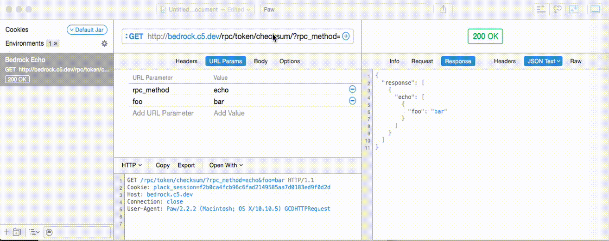

# What is this?

This is a directory for [Paw](https://luckymarmot.com/paw/) extensions. This repository is __public__ so make sure no secrets are committed. Make them configurable!

# What do the extensions do?

The first extension (com.online-rewards.PawExtensions.Rpc) signs Online-Rewards RPC requests. Once installed usage is simple:

# How do I install them?
Copy the the individual extension directories to `~/Library/Containers/com.luckymarmot.Paw/Data/Library/Application Support/com.luckymarmot.Paw/Extensions/`.